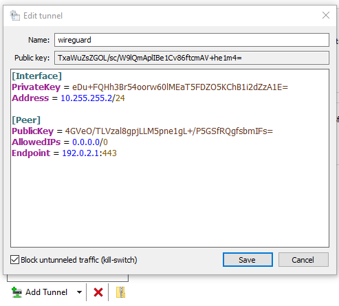

Installing and configuring a VPN using Jason Donenfield's excellent Wireguard protocol on EdgeOS (Ubiquiti's routing line) is a very simple process. In this post, I'll give configurations for road warrior scenarios for either accessing remote services/subnets routed through your EdgeOS-powered router, or browsing the internet using your EdgeOS internet connection.

<!--more-->

## About Wireguard

[Wireguard](https://www.wireguard.com) is "an extremely simple yet fast and modern VPN that utilizes state-of-the-art cryptography." In my experience, it's much faster than OpenVPN (which includes a full TLS implementation), and works better than IPSec (which often has issues with firewalls on public networks). The [codebase](https://git.zx2c4.com/WireGuard/) can be read by a single person in just a few hours, and the design is simple.

It's important to understand a little bit about how Wireguard works before we get into the details of installation. For our example, we'll talk about a 2-peer system consisting of Peer A (the EdgeOS device), and Peer B (a laptop with Wireguard running on it). Our networking will be as follows:

```
Peer    Public IP   Private IP (VPN)
A       192.0.2.1   10.255.255.1/24
B       (dynamic)   10.255.255.2/24
```

Every endpoint in the Wireguard network has a public/private keypair that is used to encrypt and decrypt packets that flow across the wireguard interface. Each endpoint also has configuration options for its local interface (what key to use, what port to listen on, and IP address(es)), as well as peer configuration options for each peer (at a minimum, a `PublicKey` and IPs that are allowed to communicate using that public key).

When Peer B sends a packet to `10.255.255.1`, it will be encrypted with Peer A's public key and sent to the endpoint configured for Peer A (`192.0.2.1` in our example). The Wireguard daemon on Peer A will check that the packet arrived from Peer B (using Peer B's public key) and then decrypt the packet with its own private key, passing along the traffic to the kernel.

## Installing for EdgeOS

A [Github repository](https://github.com/Lochnair/vyatta-wireguard) is maintained by [Nils Svee](https://lochnair.net) that tracks the main Wireguard codebase. Installation on EdgeOS is simple:

- Head to https://github.com/Lochnair/vyatta-wireguard/releases and check the board version for your device. For example, the EdgeRouter X is the `E50` board.
- As of writing, the latest revision of Wireguard is `0.0.20190913`. The package we need is at `https://github.com/Lochnair/vyatta-wireguard/releases/download/0.0.20190913-1/wireguard-e50-0.0.20190913-1.deb`
- SSH into your EdgeOS device and run these commands
```
tom@edgerouter-x:~$ sudo -i
root@edgerouter-x:~# curl -OL https://github.com/Lochnair/vyatta-wireguard/releases/download/0.0.20190913-1/wireguard-e50-0.0.20190913-1.deb
root@edgerouter-x:~# dpkg -i wireguard-e50-0.0.20190913-1.deb && rm wireguard-e50-0.0.20190913-1.deb
```

You should see the package installed:

```
Unpacking wireguard (0.0.20190913-1) ...
Setting up wireguard (0.0.20190913-1) ...
root@edgerouter-x:~#
```

## Key Generation and Config

Now you need to generate some keys for your EdgeOS device. We're going to store the private key at `/config/auth/wg.key` so that it gets backed up and persists across upgrades. Here's a handy one-liner to run at the non-root shell: `wg genkey | tee /config/auth/wg.key | wg pubkey >  wg.public`

Then, run some configuration commands to bring up the `wg0` interface:

```
set interfaces wireguard wg0 address 10.255.255.1/24
set interfaces wireguard wg0 listen-port 443
set interfaces wireguard wg0 route-allowed-ips true

set interfaces wireguard wg0 private-key /config/auth/wg.key

set firewall name WAN_LOCAL rule 20 action accept
set firewall name WAN_LOCAL rule 20 description 'WireGuard'
set firewall name WAN_LOCAL rule 20 destination port 443
set firewall name WAN_LOCAL rule 20 protocol udp
commit; save; exit
```

If you get an error from `RTNETLINK` here, reboot your EdgeOS device. The error indicates that the wireguard kernel module isn't loaded, rebooting will load it again.

Run the `wg` command to see the public key for your interface, you'll need this for your clients.
```
tom@edgerouter-x:~$ sudo wg 
interface: wg0
  public key: 4GVeO/TLVzal8gpjLLM5pne1gL+/P5GSfRQgfsbmIFs=
  private key: (hidden)
  listening port: 443
```

This will set up the listener on `udp/443` which should be unblocked by most firewalls (since Google's QUIC protocol runs on this port). You can adjust the port if needed, but keep in mind that Wireguard only runs on UDP. Popular alternatives include: `udp/53, udp/1194, udp/51820`. The firewall commands punch a hole in the firewall to allow Wireguard clients to connect. Adjust the firewall name as needed, just keep in mind that these are packets destined *to* the EdgeOS device from the internet.

At this point, your EdgeOS device is ready to start accepting clients, but you'll need to set up a client first (so you can get a keypair).

## Client Configuration

Head to https://www.wireguard.com/install/ and grab the latest installer for your platform. I'll be using the Windows client. Press Add Tunnel > Add empty tunnel... and you'll be given a public and private key. Note the public key for later.

You'll get a screen like this:



And for ease, here's the config:

```
[Interface]
PrivateKey = eDu+FQHh3Br54oorw60lMEaT5FDZO5KChB1i2dZzA1E=
Address = 10.255.255.2/24

[Peer]
PublicKey = 4GVeO/TLVzal8gpjLLM5pne1gL+/P5GSfRQgfsbmIFs=
AllowedIPs = 0.0.0.0/0
Endpoint = 192.0.2.1:443
```

The `Endpoint` should be the IP or DNS name of your EdgeOS device. The PublicKey is the public key from the EdgeOS device.

Take the public key from the client (`TxaWuZsZGOL/sc/W9lQmAplIBe1Cv86ftcmAV+he1m4=` in my example) and set up a client on the EdgeOS device:

```
configure
set interfaces wireguard wg0 peer TxaWuZsZGOL/sc/W9lQmAplIBe1Cv86ftcmAV+he1m4= allowed-ips 10.255.255.2/32
commit; save; exit
```

The above configuration is all that you need each time you add a new peer - associate the public key and the interface IP together.

You can now press Activate on the client side to bring up the VPN, and your traffic should flow through the VPN. If you want to add a new client (for instance a smartphone or another computer), use the client software to generate a key and add the public key and IP to the wireguard config on the EdgeOS side.

## Mobile App Configuration

The way I suggest creating configurations for mobile apps (iOS and Android) is to generate a config on your client (Windows/Linux/macOS) and then create a QR code from the config.

On Windows, use either [this Chrome extension](https://chrome.google.com/webstore/detail/offline-qr-code-generator/fehmldbcmhbdkofkiaedfejkalnidchm) or [this Firefox extension](https://addons.mozilla.org/en-US/firefox/addon/offline-qr-code-generator/?src=external-github-download). On Linux or macOS, create a config file called `client.conf` and then use `qrencode -t ansiutf8 < client.conf` to generate a QR code on your terminal to scan on your mobile device.

## Other considerations

The above instructions can be used to create a Wireguard VPN server (really there is not a "server" for Wireguard, just a peer that you point `0.0.0.0/0` to on the client) on any deployment. I highly recommend [Linode](https://www.linode.com) for a hosted VPS. They will give you a routed /64 block that you can pass along to your clients (just use `Address = 10.255.255.1/24, 2c03::fda8:a901:2` to specify an IP address, and add `AllowedIPs = 0.0.0.0/0, ::/0` to your client config).