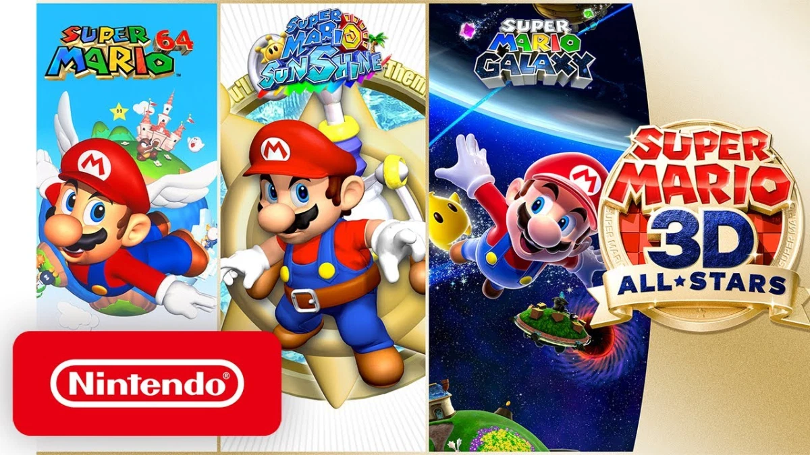

## Weekend Recap

Happy Monday to you all! I got some time in the Black Ops Multiplayer Alpha this weekend, and I have to admit, I had a lot of fun. I've been playing *a lot* of Apex Legends with my friends over the past year, and we've been getting increasingly frustrated by the scale and quantity of bugs afflicting the game. Audio issues (including no footsteps from nearby enemies, no sounds from enemy firearms, no sound from the closing ring) plague our gameplay and rank. We still play every week (check us out on [my Twitch channel](https://twitch.tv/NeonTom) on Tuesdays at 9pm EST or [Mordermi's channel](https://twitch.tv/Mordermi) on Thursdays at 9pm EST), but the issues degrade some of the fun.

Conversely, I had a lot of fun playing the Black Ops alpha. Multiple game modes, quick gameplay, and lots of great weapon variety was nice and refreshing. It could just be that it was a new game, or it could be that I am coming around to Treyarch's flagship franchise. Only time will tell.

I also played some of 2018's *Marvel's Spider-Man* this weekend, and I'm now around 30% done with the main story. I just had a run-in with Shocker, listened to load's of J Jonah Jameson's lies and conspiracies about Spider-Man, and saved MJ from the Demons in the Museum. I'm interested to see where the story goes next!



> Spider-Man vs Shocker

## The Talos Principle

I'm revisiting an older game that I particularly love after watching a friend playing through *Portal 2*. *The Talos Principle* is like *Westworld* meets *Portal*, in that there's a heavy-handed philosophical narration element to this puzzle-solving game. Croteam (the studio behind Serious Sam) has created a delightful first-person puzzle game. Tom Jubert (of FTL and The Swapper) wrote for the project, and he's done a phenomenal job, alongside Jonas Kyratzes.

The game starts off simply enough; they player -- a humanoid robot -- wakes up on a stone table and hears the voice of Elohim explaining that this entire world was created for the player. We must solve puzzles to learn more about Elohim (similar to Portal's "solve puzzles for science" mantra), and eventually, we'll be granted access to Elohim's temple.

There are plenty of puzzle mechanics to explore: hexahedrons (cubes) for depressing switches, platforming, and blocking lasers; "connectors" for connecting laser beams to targets on walls and floors; switches, levers, hidden buttons, coded messages, and more! There are also computer terminals scattered about the landscape, detailing the beginnings of the Talos project, e-mails from staff of the project, and literature assignments. There are excerpts from classic literature, and lots of the data is corrupted, leaving you always searching for another terminal to put the pieces together.

There are hidden objectives alongside the "main" objectives: hidden stars on each level to collect to enable access to extra puzzle chambers. Overall, this game is a lot of fun, and it's currently on Xbox Game Pass. Check it out if you need something new to play!



> Philosophical puzzle-solving

## Resident Evil 7: Biohazard

This weekend, I'll be playing my first Resident Evil game (thanks to Game Pass). I don't have a lot to say about this except I can't wait to start. If you'd like to join me for my foray into this horror classic, you can check out my twitch channel this Saturday at 9pm EST.

## Super Mario 3D All-Stars

### So long, Gay Bowser

Yes, I'm aware that I could just emulate these games on my PC. Yes, I'm aware they'd look better if I did (fullscreen, HD texture packs, etc). But, I like the convenience of my Switch, and playing these games on the couch or in the bed or in my office is something I'm really looking forward to.

Mario 64 was (I believe) my first 3D platformer as a kid. It's certainly the one I spent the most time playing, and I'm excited to jump back into the paintings to collect all 120 Stars. Sunshine and Galaxy are games that I played and finished as a teen, but don't have strong memories of, so I'll be "re-experiencing" them this week on my Switch.

What is *your* favorite 3D Mario game? Mine is probably 3D Worlds or Odyssey. Let me know yours in the comments below or on Discord!

## Hades

### ROGUE LIKE. DUNGEON CRAWLER. HACK AND SLASH.

Supergiant Games (*Bastion*, *Transistor*, *Pyre*) brings a fantastic new entry to the Switch (it's also been on PC for a few months in Early Access). Rogue-likes are maybe my favorite genre of game (closely tied with Metroidvanias), and Hades is easily one of my favorite titles to date. It's a game set in Hades (clever, huh?) based around Greek mythology. The object of the game is to escape the underworld and make it to Olympus, but that's quite a Herculean task.

You'll gain assistance in the form of weapon upgrades and powerups from the other Greek gods - Poseidon gives you the power of the sea, Zeus gives your weapons the power of lightning, and Dionysius offers drinks to slow down enemies.

Supergiant's phenomenal writing shines in this already excellent game, with so much personality and heart to the characters that there's no one I feel isn't fully fleshed out. I've been having so much fun with this game on PC, and I was so happy to see that it came to Switch.

## Conclusion

Lots of words to say "I'm playing some fun games this week", but that's what a blog is for, right? These entries aren't meant to be full-fledged reviews of these titles, but more of an off-the-cuff summary/braindump about them. I just like to keep everyone in the loop of what I'm playing off-stream as well.

Have a great week, I'll check in next Monday with another post!

`- Tom`